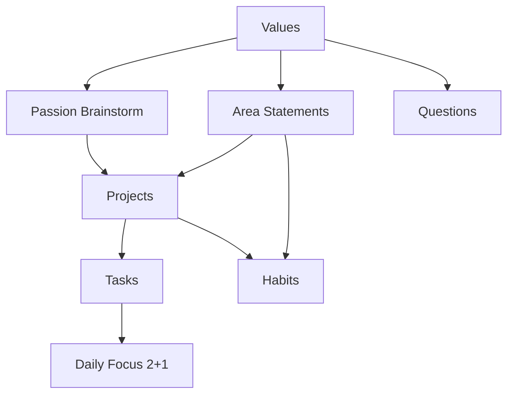
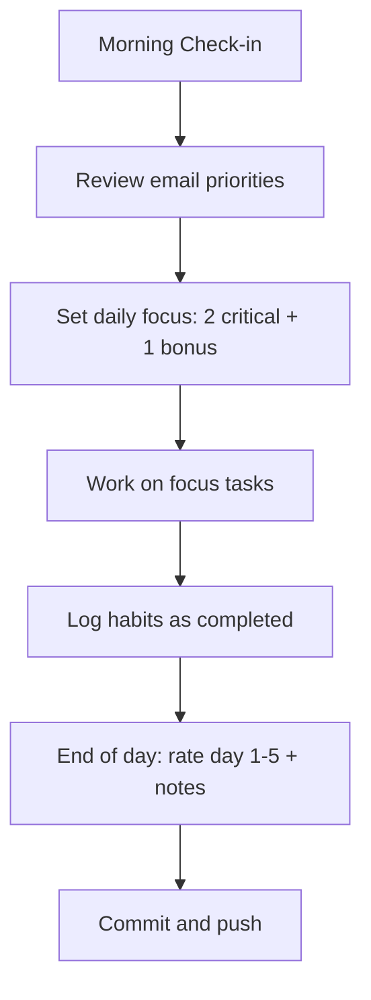
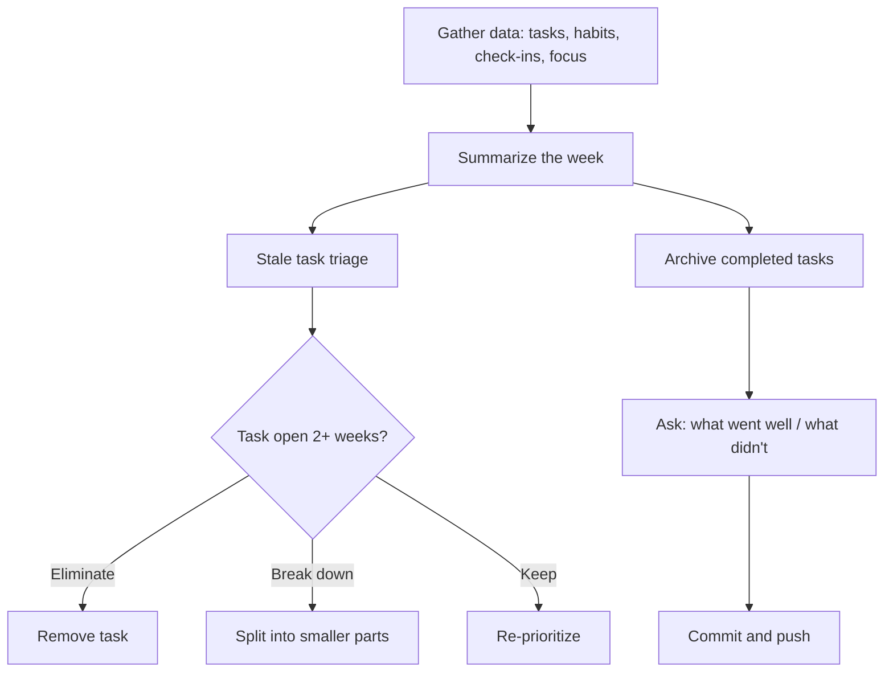
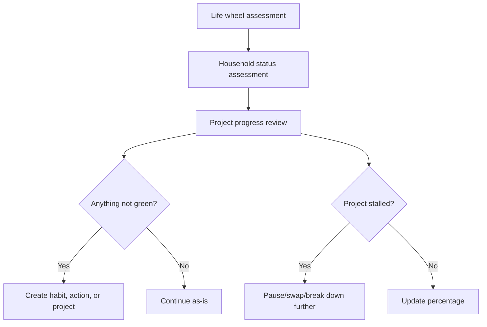
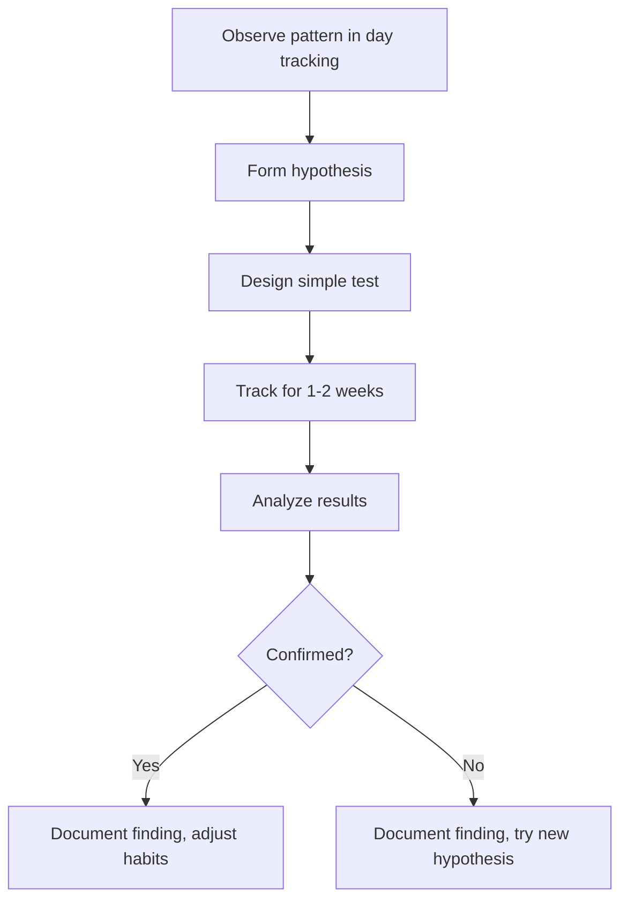

# Workflows

Visual documentation of how the productivity system works. Diagrams use Mermaid syntax.

## System Flow — Values to Actions

## Daily Flow

## Weekly Review Flow

## Monthly Check-in Flow

## Hypothesis Testing Flow

